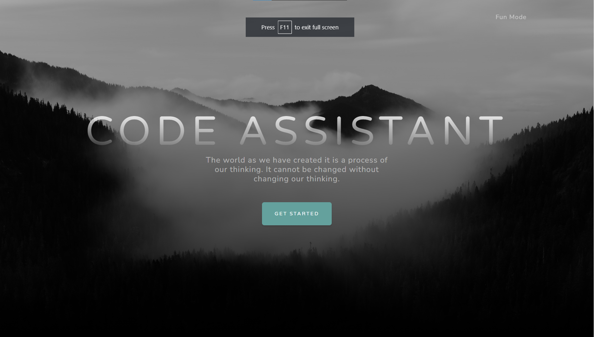
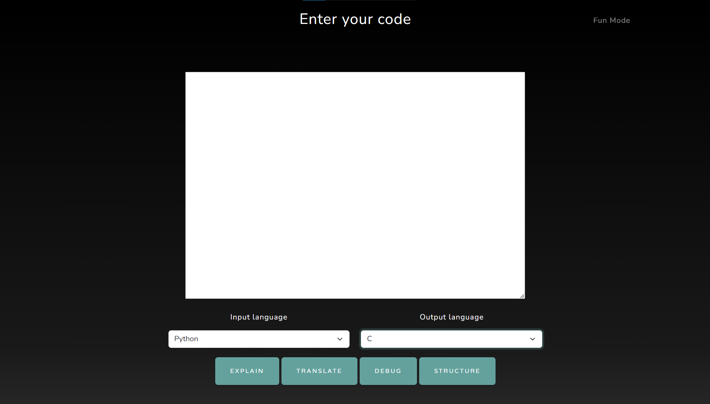
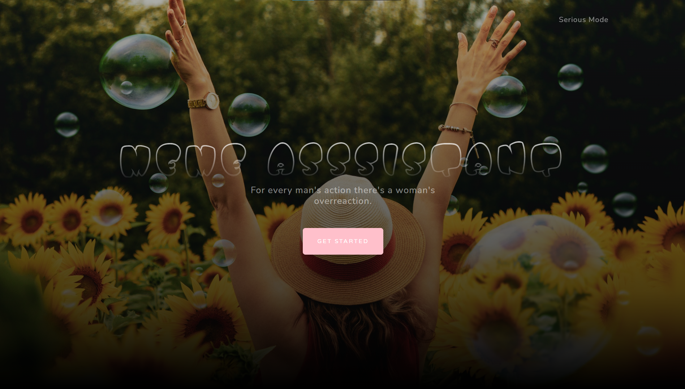

<div style="font-size: 20px;">

# Assistant
Welcome to <span style="font-size: 24px;">**Assistant**</span> , your ultimate <span style="font-size: 24px;">**coding companion**</span> and <span style="font-size: 24px;">**meme maestro**</span>!

# Features

* <span style="font-size: 24px;">**Auto-Generated Data Structures & Scripts**</span>: Effortlessly create data structures and scripts from your descriptions, saving you time and boosting productivity.

* <span style="font-size: 24px;">**Meme Generator**</span>: Unleash your inner meme master and explore the <span style="font-size: 24px;">**hilarious**</span> side of programming with our <span style="font-size: 24px;">**meme generator**.

* <span style="font-size: 24px;">**Funny supprise features**</span>: Get ready to be amazed by our <span style="font-size: 24px;">**surprise feature**</span>, guaranteed to keep you entertained and intrigued.

# Screenshots

**Code assistant**<br>
<br>
**Code assistant functionalities**<br>
<br>
**Meme assistant**<br>
<br>
**Meme assistant functionalities**<br>
<br>


## Technologies Used
- Python (Flask)
- JavaScript
- HTML, CSS
- Bootstrap
- OpenAI API
- Meme API

## Usage
1. Create a python virtual environment
```
python -m venv <venv_name>
```

2. Activate the environment (different for each platform)
```
bash/zsh
$ source <venv>/bin/activate

fish
$ source <venv>/bin/activate.fish

csh/tcsh
$ source <venv>/bin/activate.csh

PowerShell
$ <venv>/bin/Activate.ps1

cmd.exe
C:\> <venv>\Scripts\activate.bat

PowerShell
PS C:\> <venv>\Scripts\Activate.ps1
```

3. Install the libraries in requirements.txt file using:

```
pip install -r requirements
```

4. Run the server.py file using:

```
python server.py
```
or
```
python3 server.py
```

5. Open the localhost link in your browser and enjoy!

</div>